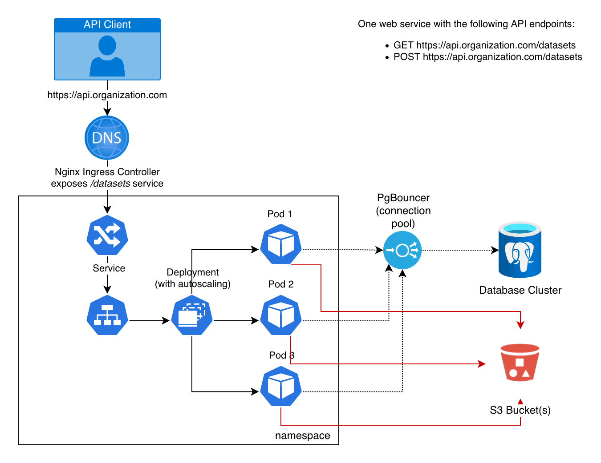
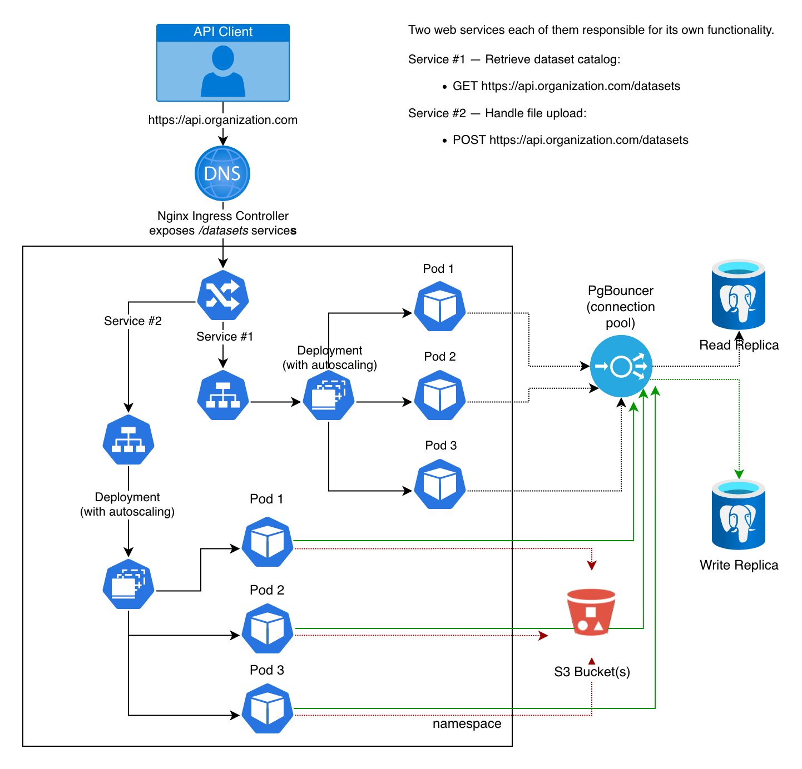
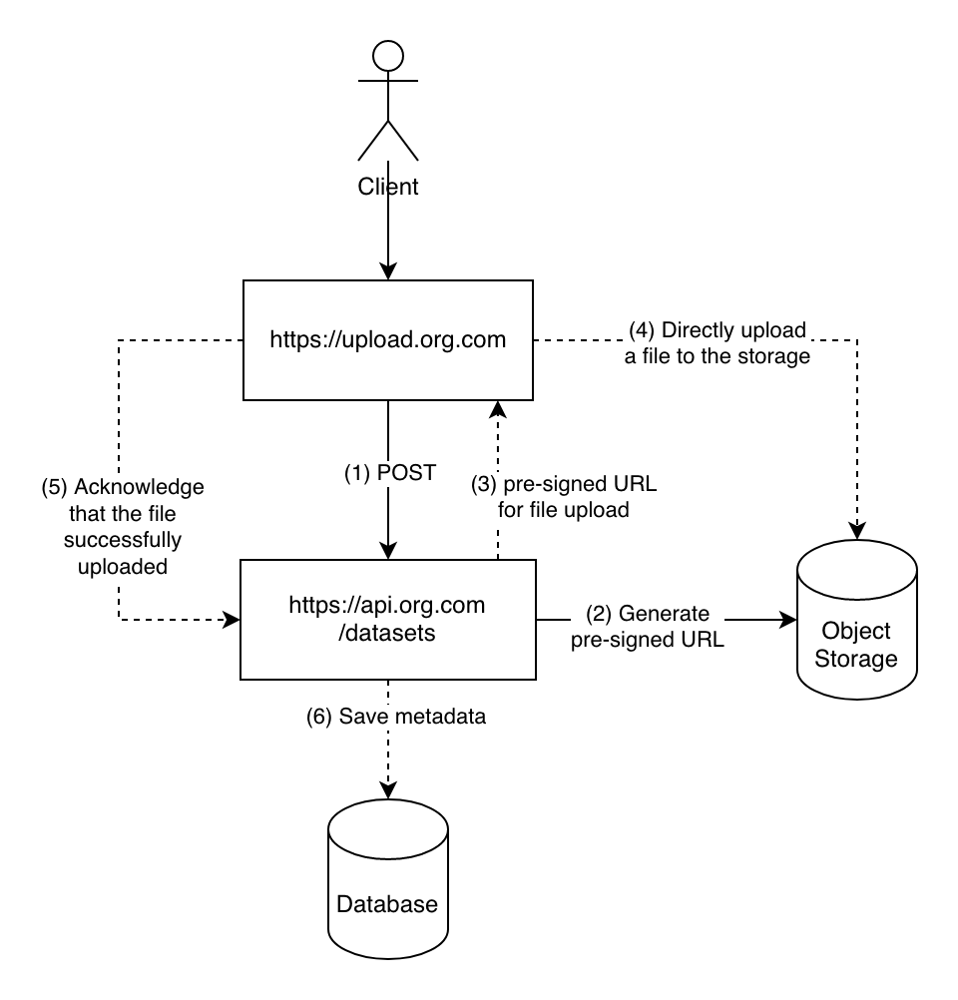

# System Design

## Task

Code a simple backend for the application described below.

1. Read datasets from a data store

- Which URL/Endpoint would you use for that?
- Which HTTP verb?
- Which parameters (query, path, header, body parameters, ...) would you allow?

Write a REST service in Python.
Think about what input (query, path, header, body parameters, ...) would you allow, if any.
This is an output example, if we returned several datasets:

```json
[
    {
        "name": "Employees",
        "path": "/data/employees.csv"
    },
    {
        "name": "Customers",
        "path": "/data/customers.csv"
    }
]
```

2. Upload a dataset to the data store

- Which URL/Endpoint would you use for that?
- Which HTTP verb?
- Which parameters (query, path, header, body parameters, ...) would you allow?

Our customers' datasets are big and sometimes don't fit in memory. How would you handle that?
Write a REST service in Python able to manage big datasets.

The input (query, path, header, body parameters, ...) for the service would be the dataset as such
whereas the output doesn't really matter here. Returning a HTTP 201 would suffice if the dataset
is added successfully.

## Thinking About Constraints

The initial task includes two "services". One of them is pretty simple and serves as a fetching
mechanism for metadata of uploaded datasets.

But the another one, for uploading files, raises many questions and design decisions.
What we have there is **IO bound task** for transferring a stream of bytes from one machine,
say customer, to another, say our storage. Because of the task we use HTTP protocol which is
stateless and based on TCP/IP layer, we should keep in mind at least two things:

1. How we handle a network connection depends on an application server and the infrastructure in
front of it — web server, reverse-proxy, load-balancer etc.
2. If a network connection drops, we need to somehow resume the upload or start from the beginning
removing not complete files in our storage.

At the first look, for implementing the file upload we can choose any async framework like FastAPI
and application server like Uvicorn running with `(2 x $num_cores) + 1` working processes which
means we can scale almost lineary. One thing is worth to mention though. We know nothing about
amount of read and write requests in our imaginary backend (RPS, network bandwidth, an amount of
simultaneous connections). Maybe even thread-based WSGI application server like Gunicorn
(1 network connection → 1 thread) will work just fine for us and we don't care about throughput much.
Moreover, there is no non-blocking file access on Linux systems yet. And many async libraries and
packages only provide an async interface to developers while still working with file systems in thread pools.
But doesn't matter which option we choose, we still have to deal with slow and hanging connections.
These problem is less critical for highly concurrent and/or reliable systems when you don't afraid
of memory leaks or your application server and/or infrastructure are build in a scalable way.
For simplicity, we can just use Nginx in front of our backends with such settings:

```shell
# allow the server to close connection on non responding client, this will free up memory
reset_timedout_connection on;

# request timed out -- default 60
client_body_timeout 10;

# if client stop responding, free up memory -- default 60
send_timeout 2;

# server will close connection after this time -- default 75
keepalive_timeout 30;

# number of requests client can make over keep-alive -- for testing environment
keepalive_requests 100000;
```

Tuning other options like `client_body_buffer_size` can also improve performance.

What about infrastructure and our IO-bound task? Choosing the right instance type or pod limits
depends on the low-level implementation details of our web service.

But we know that:

- Working with files involves working with threads → we can't scale much on CPU (vertical scaling)
because of GIL. The only thing we can do is to set the right number of worker processes.
- We don't want to read an upload file in memory because it'll crash an application.
We can use something like `tempfile.SpooledTemporaryFile` and attach additional volumes
to our instances (VM, pods, etc.) for temporary files that will be deleted when upload ends.

_If I choose the technology stack for implementing networking service for file upload, I would
go with Golang. It has solid network library, scales better, utilize more resources, and more
importantly, gives developer a direct access to the stream of bytes._

## Data Storage

Before moving forward, let's discuss where we store uploaded datasets. We want to have big storage
with relatively quick access to the files, with a proper level of reliability. Any object storage
like Amazon S3 or [Minio](https://min.io/) will work for us.

Moreover, often such solutions provide many helpful features via API or SDK. Some features we can use:

- Streaming data directly without processing and storing it on our backends.
- Recursively listing uploads — all the necessary metadata is already stored in the object storage.
See the [list_objects](https://docs.min.io/docs/python-client-api-reference.html) method.
Keeping this in mind, we don't need to store dataset paths in our database. The only reason we need
it is when we build relations with, say, customer data and its uploads.
- [Multipart Upload](https://docs.aws.amazon.com/AmazonS3/latest/userguide/mpuoverview.html)

## Possible Implementations

You can find four possible _high-level_ system designs below.
Some of the solutions utilize Kubernetes environment.

### One Backend



### Two Backends



### On-demand Backend

If customers upload datasets rarely, the third option is to dynamically (programmatically) spin up
a web service that is only available during the file upload. When the file successfully uploaded to
the storage, the on-demand web service shuts down.

### * Generating Pre-signed URL

This is my favorite solution so far. We don't need to reinvent the wheel, because AWS already has
functionality for directly uploading files via
[pre-signed URL](https://docs.aws.amazon.com/AmazonS3/latest/userguide/PresignedUrlUploadObject.html).
Therefore, we can focus on the web service interface instead of thinking about all the corner
cases related to the file upload.

Yes, we still need to write some code for gluing things together like:

- generate a pre-sign URL via S3 SDK
- return that link to the client
- write a frontend code that sends POST or PUT request to that link, depending on our preferences

But thanks to object storage, we get rid of a whole class of possible problems.

P.S. The described approach also works with
[Minio](https://docs.min.io/docs/python-client-api-reference.html#presigned_put_object).



## Choosen Implementation

So, we have four options for implementing our services. Which one you should choose?
My recommendation will be:

1. Develop one backend service handling both data discovery and dataset upload.
2. Don't implement the file upload on your backend. Use S3-compatible storage if you can.
Write an API method that gives a client a pre-signed URL for uploading the dataset directly to
the storage (imagine you initialize an upload session). If something bad happens to the upload,
your backend is safe and you don't have corrupted files in your storage.
Another option is to implement [multipart upload](https://docs.aws.amazon.com/AmazonS3/latest/userguide/mpuoverview.html).
3. Implement a third API endpoint like `POST /datasets/{path}/action/acknowledge` if you need to
write some metadata to your database. This endpoint can check if the object exists in your storage
after successful upload and write additional information about the dataset provided by, say, the user.
It can be dataset name, comments, anything.

_Despite my advice above, for the sake of the task, I'm going with a naive implementation of
handling file upload manually on the FastAPI level and will explorer if it's possible to stream
datasets directly to the storage._

## Infra

- If you decide going with Nginx as reverse proxy, don't forget about configuring:
  - CORS headers
  - The `client_max_body_size` setting to limit a size of uploads
- Use something like Prometheus and Grafana for monitoring application health and resource utilization.
- Helm package to deploy all the resources in one shot.
